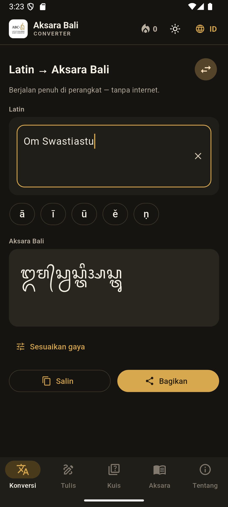
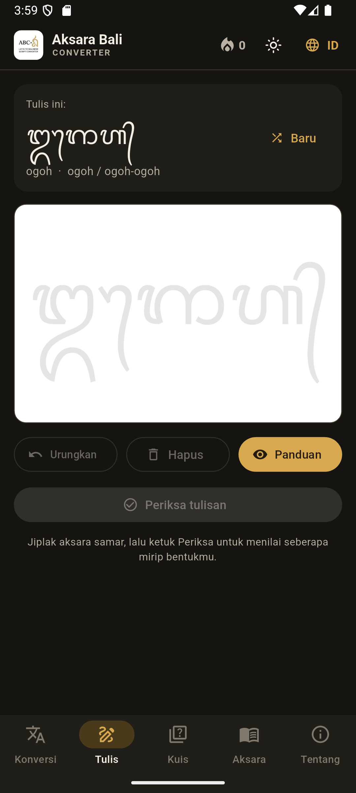
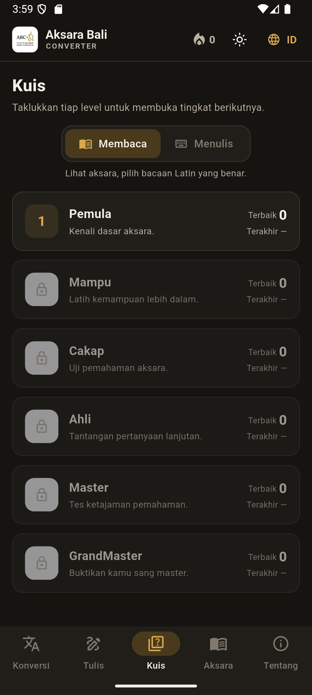
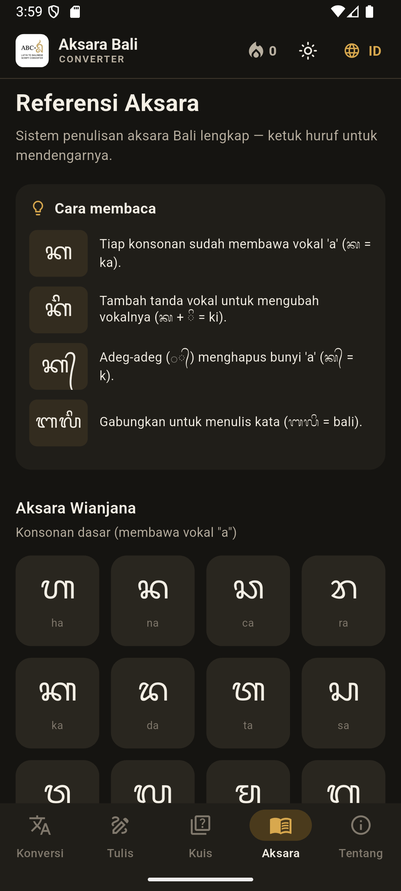
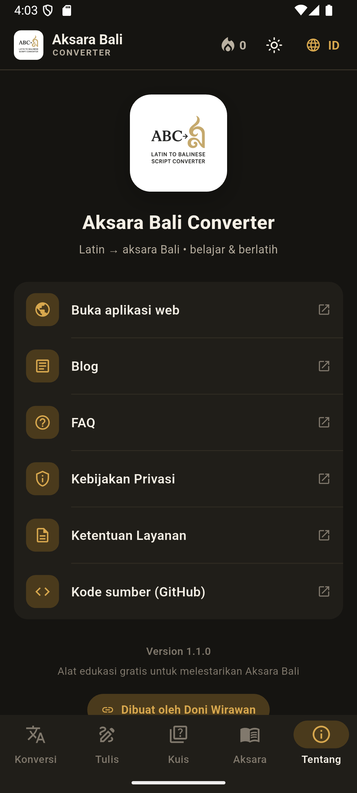

# Aksara Bali Converter

A full-featured web app for learning and converting Balinese script (Aksara Bali). Built with Next.js and Supabase.

🌐 **Live demo**: [transliterasi-latin-ke-bahasa-bali.vercel.app](https://transliterasi-latin-ke-bahasa-bali.vercel.app)
📱 **Android app**: [Get it on Google Play (test track)](https://play.google.com/apps/internaltest/4700728977787153239) · [Download the latest APK](https://github.com/doniwirawan/aksara-bali/releases/latest)


[](https://ko-fi.com/L7T7234BJ2)

---

## 📱 Android App

A fully **offline** Android companion — convert, practice, and learn Aksara Bali on your phone. Built with Flutter, sharing the same transliteration engine as the web app.

<p align="center">
  
  
  
  
  
</p>
<p align="center"><sub>Converter · Writing practice · Leveled quizzes · Aksara reference · About</sub></p>

<p align="center">
  <a href="https://play.google.com/apps/internaltest/4700728977787153239"><b>▶️ Get it on Google Play (test track)</b></a>
  &nbsp;·&nbsp;
  <a href="https://github.com/doniwirawan/aksara-bali/releases/latest"><b>⬇️ Download the latest APK</b></a>
  &nbsp;·&nbsp;
  <a href="https://github.com/doniwirawan/aksara-bali/releases/tag/v1.1.0">v1.1.0 release notes</a>
</p>

- **Latin ↔ Aksara Bali** converter, fully on-device — no internet required
- **Leveled quizzes** with daily streak targets and achievements
- **Tap a letter to hear** its pronunciation (on-device text-to-speech)
- **Writing practice** and an on-screen **Balinese keyboard** (reverse input)
- **Aksara reference** and word-art styling with transparent PNG export
- Light/dark themes (Material 3) and bundled **Noto Sans Balinese** font

> **Google Play** — join the test track via the
> [opt-in link](https://play.google.com/apps/internaltest/4700728977787153239), then install
> from Play. The public store listing goes live once the app reaches Production.
>
> Sideload instead: enable **"Install unknown apps"**, then open the downloaded APK.
> The APK build is debug-signed; the Play build is Play-signed.

---

## Features

### ⚡ Latin → Aksara Bali Converter
- Real-time character-by-character transliteration
- 100+ Sanskrit term database with V=W equivalency (Vishnu = Wisnu)
- Auto-detect, Sanskrit-only, and Balinese-only modes
- Copy result, share link, and offline support

### 🎯 Practice — Quiz Mode
- Image-based recognition quizzes
- Score tracking saved to your account
- Progressive difficulty across all Balinese characters

### ✍️ Practice — Writing Canvas
- Draw Aksara Bali with mouse, touch screen, or **hand gestures** (MediaPipe Hands)
- **Gesture writing** uses an `idle → writing → pending_end` state machine so brief
  tracking losses don't break strokes; EMA-smoothed, supersampled (crisp) strokes
- **Gesture controls**: index point = draw, open palm = local eraser (rubs out near
  the palm, not a full wipe), pinch = lift pen
- Shape-matching score is **position- and scale-invariant** (both your writing and
  the reference are normalized to their bounding boxes before comparison)
- **Fullscreen mode** with an in-canvas toolbar, a toggleable aksara guide overlay,
  and **hands-free auto-scoring** after you stop writing
- Loads MediaPipe with a progress bar and caches it (service worker) for instant reloads

### 🎹 Practice — Balinese Keyboard
- On-screen keyboard for composing Balinese text directly
- Aksara Wianjana, Pangangge, and punctuation tabs

### 📝 Blog
- Articles about Aksara Bali history, structure, and cultural context
- Managed via the admin dashboard, stored in Supabase
- Bilingual content (Indonesian + English), category filtering, related posts

### 📊 Learning Dashboard
- Personal stats: conversion count, quiz scores, writing practice history
- Tracks progress over time, requires login

### ❓ FAQ
- Categorized Q&A about Balinese script, app usage, and technical details
- Admin-managed via Supabase

### 🛡️ Admin Dashboard
- Manage blog posts (Markdown, bilingual, Unsplash photo picker)
- Manage FAQ items
- View aggregate usage stats and registered users
- Protected by Supabase JWT authentication

### Other
- **PWA**: Install as a native app, offline basic conversion works
- **Dark / Light mode**: Persisted to localStorage
- **Bilingual UI**: Indonesian and English
- **SEO**: Structured data, canonical URLs, Open Graph, sitemap

---

## Tech Stack

| Layer | Technology |
|---|---|
| Framework | Next.js 15 (Pages Router) |
| Language | JavaScript (JSX) |
| Database / Auth | Supabase (PostgreSQL + Supabase Auth) |
| Hand Gesture | MediaPipe Hands (via CDN) |
| Photos | Unsplash API (with proper attribution + download tracking) |
| Font | Noto Sans Balinese (Google Fonts) |
| Deployment | Vercel |

---

## Public API

CORS-enabled JSON endpoints — usable from a web, mobile, or **Flutter** client.
Base URL: `https://transliterasi-latin-ke-bahasa-bali.vercel.app`

> The app uses `trailingSlash: true`, so always call the **trailing-slash** form
> (`/api/convert/`) to avoid a 308 redirect.

### `GET|POST /api/convert/` — Latin → Aksara Bali

```bash
# GET
curl "https://transliterasi-latin-ke-bahasa-bali.vercel.app/api/convert/?text=halo"

# POST
curl -X POST "https://transliterasi-latin-ke-bahasa-bali.vercel.app/api/convert/" \
  -H "Content-Type: application/json" -d '{"text":"halo"}'
```

```json
{ "latin": "halo", "balinese": "ᬳᬮᭀ" }
```

Errors: `400` (missing `text`), `413` (over 5000 chars).

### `GET /api/words/` — practice/quiz word list

```bash
curl "https://transliterasi-latin-ke-bahasa-bali.vercel.app/api/words/?difficulty=easy"
```

```json
{ "count": 20, "words": [ { "latin": "...", "difficulty": "easy", "balinese": "..." } ] }
```

Optional `?difficulty=easy|medium|hard`.

### Flutter / Dart example

```dart
import 'dart:convert';
import 'package:http/http.dart' as http;

Future<String> toBalinese(String text) async {
  final res = await http.post(
    Uri.parse('https://transliterasi-latin-ke-bahasa-bali.vercel.app/api/convert/'),
    headers: {'Content-Type': 'application/json'},
    body: jsonEncode({'text': text}),
  );
  return jsonDecode(res.body)['balinese'] as String;
}
```

> **Logging/admin endpoints** (`/api/conversions`, `/api/quiz-results`,
> `/api/writing-checks`, `/api/events`, `/api/blog-posts`, `/api/faq-items`,
> `/api/admin-users`) exist for the web app's own analytics/CMS and may require a
> Supabase auth token. For a mobile app you typically only need `/api/convert/`
> and `/api/words/`.

---

## Getting Started

### 1. Clone

```bash
git clone https://github.com/doniwirawan/aksara-bali.git
cd aksara-bali
npm install
```

### 2. Set up Supabase

1. Create a project at [supabase.com](https://supabase.com)
2. Run `supabase-schema.sql` in the Supabase SQL Editor to create all tables
3. Enable **Email Auth** under Authentication → Providers
4. Register your admin email in Supabase Auth (Authentication → Users → Invite)

### 3. Environment variables

Copy `.env.example` to `.env.local` and fill in your values:

```bash
cp .env.example .env.local
```

| Variable | Where to find it |
|---|---|
| `NEXT_PUBLIC_SUPABASE_URL` | Supabase → Settings → API |
| `NEXT_PUBLIC_SUPABASE_ANON_KEY` | Supabase → Settings → API |
| `SUPABASE_SERVICE_ROLE_KEY` | Supabase → Settings → API (secret) |
| `NEXT_PUBLIC_ADMIN_EMAIL` | The email you registered as admin |
| `UNSPLASH_ACCESS_KEY` | [unsplash.com/developers](https://unsplash.com/developers) (optional) |
| `NEXT_PUBLIC_SITE_URL` | Your production URL |

### 4. Run locally

```bash
npm run dev
```

Open [http://localhost:3000](http://localhost:3000).

---

## Database Schema

All tables are defined in `supabase-schema.sql`. Run it once in the Supabase SQL Editor.

| Table | Purpose |
|---|---|
| `blog_posts` | Blog articles (title, content, image + Unsplash attribution, published flag) |
| `faq_items` | FAQ entries by category |
| `quiz_results` | Quiz attempts (per-user via `user_id`, plus anonymous) |
| `writing_checks` | Writing-practice results (per-user via `user_id`, plus anonymous) |
| `conversions` | Conversion log (per-user via `user_id`, plus anonymous) |
| `events` | Generic analytics — page views & click events |

Migrations (also bundled in `supabase-schema.sql`, safe to re-run):

```sql
-- per-user ownership (scripts/add-user-id.sql)
ALTER TABLE conversions    ADD COLUMN IF NOT EXISTS user_id uuid REFERENCES auth.users(id);
ALTER TABLE quiz_results   ADD COLUMN IF NOT EXISTS user_id uuid REFERENCES auth.users(id);
ALTER TABLE writing_checks ADD COLUMN IF NOT EXISTS user_id uuid REFERENCES auth.users(id);
-- Unsplash attribution (scripts/add-unsplash-attribution.sql)
ALTER TABLE blog_posts ADD COLUMN IF NOT EXISTS image_credit TEXT;
ALTER TABLE blog_posts ADD COLUMN IF NOT EXISTS image_credit_url TEXT;
ALTER TABLE blog_posts ADD COLUMN IF NOT EXISTS image_source_url TEXT;
```

---

## Project Structure

```
aksara-bali/
├── components/
│   ├── LatinBalineseConverter.jsx   # Main converter UI
│   ├── Navbar.jsx
│   ├── Footer.jsx
│   ├── LanguageSwitcher.jsx
│   └── practice/
│       ├── QuizMode.jsx             # Quiz practice
│       ├── HandGestureCanvas.jsx    # Writing canvas + MediaPipe
│       └── BalineseKeyboard.jsx     # On-screen keyboard
├── context/
│   └── AuthContext.jsx              # Supabase auth session
├── pages/
│   ├── index.jsx                    # Landing page + converter
│   ├── practice.jsx                 # Practice hub (quiz/write/keyboard)
│   ├── blog/
│   │   ├── index.jsx                # Blog listing
│   │   └── [slug].jsx               # Blog article
│   ├── dashboard/index.jsx          # Learning dashboard
│   ├── faq.jsx                      # FAQ page
│   ├── admin/index.jsx              # Admin dashboard
│   ├── auth/
│   │   ├── login.jsx
│   │   └── register.jsx
│   └── api/
│       ├── convert.js               # Public: Latin → Balinese (CORS)
│       ├── words.js                 # Public: practice word list (CORS)
│       ├── events.js                # Analytics: page views / clicks
│       ├── blog-posts.js
│       ├── faq-items.js
│       ├── quiz-results.js
│       ├── writing-checks.js
│       ├── conversions.js
│       ├── unsplash-search.js       # Proxy + format Unsplash results
│       ├── unsplash-download.js     # Trigger Unsplash download event
│       └── admin-users.js
├── utils/
│   ├── balineseConverter.js         # Transliteration engine
│   ├── supabase.js                  # Supabase client helpers
│   ├── admin.js                     # Admin-email check (env-based)
│   ├── analytics.js                 # Client page-view / click tracking
│   └── practiceTranslations.js
├── public/
│   └── data/sanskrit-database.json  # 100+ Sanskrit terms
├── supabase-schema.sql
├── scripts/add-unsplash-attribution.sql
├── mobile-app/                      # Flutter Android app (offline converter, quiz, write)
└── .env.example
```

---

## Deployment

This project is optimised for **Vercel**:

```bash
npm i -g vercel
vercel
```

Set all environment variables in the Vercel dashboard under **Settings → Environment Variables** before deploying to production.

---

## Unsplash Attribution

This app integrates with the Unsplash API following their [official guidelines](https://unsplash.com/api-terms):

- All images use hotlinked URLs from `photo.urls` properties
- Download events are triggered server-side via `/api/unsplash-download` when an admin selects a photo
- Every blog post hero image shows "Photo by [Name] on Unsplash" with UTM-tracked links back to the photographer's profile and the specific photo page

---

## Contributing

1. Fork the repository
2. Create a feature branch: `git checkout -b feature/my-feature`
3. Commit your changes
4. Open a pull request

Please do not commit `.env.local` or any file containing real API keys or credentials.

---

## License

PolyForm Noncommercial License 1.0.0 — free to use, modify, and share for
**noncommercial** purposes. See [LICENSE](LICENSE) for details.

---

## Acknowledgements

- [Supabase](https://supabase.com) — database and authentication
- [MediaPipe](https://mediapipe.dev) — hand gesture recognition
- [Unsplash](https://unsplash.com) — photography
- [Google Fonts — Noto Sans Balinese](https://fonts.google.com/noto/specimen/Noto+Sans+Balinese) — script rendering
- [Unicode Consortium](https://www.unicode.org/charts/PDF/U1B00.pdf) — Balinese script standardisation (U+1B00–U+1B7F)
- Balinese cultural heritage community

---

*Built for educational purposes and cultural preservation of the Aksara Bali script tradition.*
